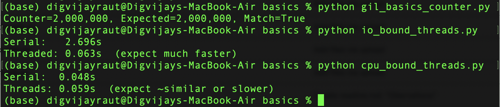

# Python GIL and Threading Basics

This repository contains simple experiments to explore how Python's Global Interpreter Lock (GIL) affects CPU-bound and IO-bound tasks.

## Files and Observations

### cpu_bound_threads.py
Compares serial vs threaded execution for CPU-heavy tasks.  
**Observation:** Threads run about the same or slightly slower than serial because of the GIL.

```
Serial: 0.048s
Threads: 0.061s (expect ~similar or slower)
```

### gil_basics_counter.py
Demonstrates correctness of multithreaded increments with a lock under the GIL.  
**Observation:** Counter matches the expected value when using a lock, ensuring correctness.

```
Counter=2,000,000, Expected=2,000,000, Match=True
```

### io_bound_threads.py
Compares serial vs threaded execution for IO-heavy tasks.  
**Observation:** Threads are much faster than serial since IO operations release the GIL.

```
Serial: 2.699s
Threaded: 0.062s (expect much faster)
```

## Key Learnings
- For **CPU-bound tasks**, threads don’t improve performance due to the GIL.  
- For **IO-bound tasks**, threads can be much faster since IO operations release the GIL.  
- **Locks** are required to ensure correctness when multiple threads update shared data.  

## Example Run


## How to Run
Run each script from the terminal:

```bash
python cpu_bound_threads.py
python gil_basics_counter.py
python io_bound_threads.py
```
